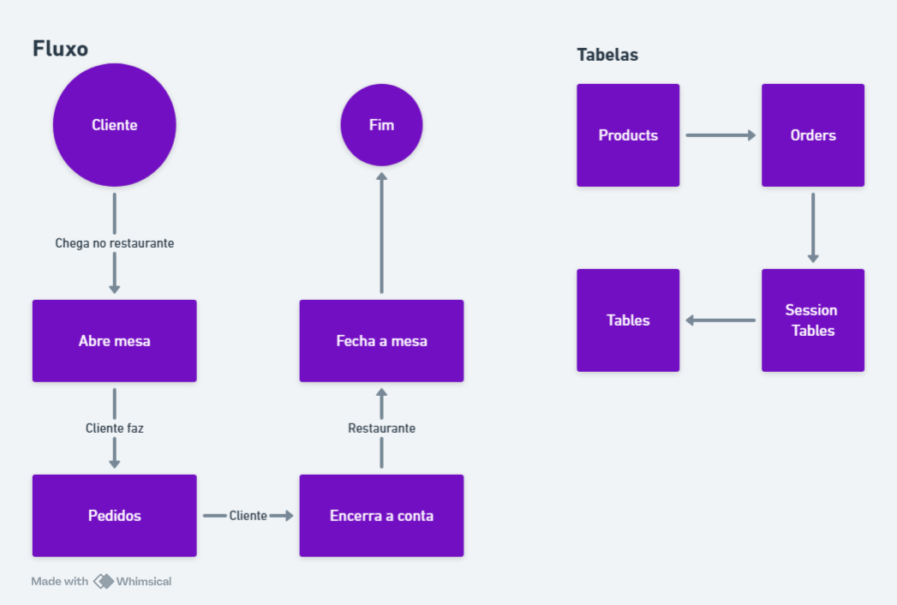

# API de Pedidos para um Restaurante


## Introdução
Uma API desenvolvida com o intuito de registrar os processos de atendimento ao cliente em um restaurante.

O cliente chega ao restaurante e se senta em uma mesa (*Tables*), o restaurante registra a abertura que fica armazenado na tabela *SessionTables*. O cliente realiza um pedido de acordo com o cardápio armazenado na tabela *Products*, o pedido fica registrado na tabela *Orders*.

- **Formatos suportados:** JSON

## Endpoints
### Products
#### Obténdo um produto
- Método: `GET`
- Rota: `/products`
Retorna um array de objetos.
```json
[
  {
	"id": 1,
	"name": "Bife a cebolado",
	"price": 33.29,
	"created_at": "2025-01-01 00:00:01",
	"updated_at": "2025-01-01 00:00:01"
  }
]
```

#### Criando um produto
- Método: `POST`
- Rota: `/products`
Recebe um JSON no body com as propriedades *name* e *price*.
```json
{
	"name": "Contra filé a parmegiana",
	"price": 38.00
}
```
Retorna um JSON vázio com um *status code* de *201 Created*.

#### Atualizando um produto
- Método: `PUT`
- Rota: `/products/:id`

Recebe um JSON com uma propriedade *name* e *price*.
```json
{
	"name": "Contra filé",
	"price": 32.00
}
```
Retorna JSON vázio com um *status code* de *200 Successuful*.
- OBS:. Lança um erro se qualquer uma das propriedades forem omitidas.

#### Deletando um produto
- Método: `DELETE`
- Rota: `/products/:id`
Retorna um JSON com a mensagem "Deletado com sucesso!"

### Mesas
#### Obtendo as mesas
- Método: `GET`
- Rota: `/tables`
Retorna um JSON conténdo as mesas geradas por um *Seed* atráves do *[Knex.js](https://knexjs.org/)*
```json
{
	"tables": [
		{
		  "id": 1,
		  "table_number": 1,
		  "created_at": "2025-01-01 00:00:01",
		  "updated_at": "2025-01-01 00:00:01"
		},
		{
		  "id": 2,
		  "table_number": 2,
		  "created_at": "2025-01-01 00:00:01",
		  "updated_at": "2025-01-01 00:00:01"
		}
	]
}
```

### Sessões da mesa
#### Criando uma sessão
- Método: `POST`
- Rota: `/tables-sessions`
Recebe um JSON com a propriedade *table_id*, para identificar qual mesa está sendo aberta.
```json
{
	"table_id": 1
}
```
Retorna um JSON vázio com um *status code* de *200*.

#### Obtendo um sessão
- Método: `GET`
- Rota: `/tables-sessions`
Retorna um JSON com um array de objetos.
```json
[
	{
	  "id": 1,
	  "table_id": 1,
	  "opened_at": "2025-01-06 11:30:00",
	  "closed_at": null
	}
]
```

#### Fechando uma sessão
- Método: `PATCH`
- Rota: `/tables-sessions/:table_id`
Retorna JSON vázio, um *status code* de *200*, e atualiza a propriedade *closed_at*.

Exemplo das alterações:
```json
[
	{
	  "id": 1,
	  "table_id": 1,
	  "opened_at": "2025-01-06 11:30:00",
	  "closed_at": "2025-01-06 12:30:00"
	}
]
```

### Pedidos
#### Criando um pedido
- Método: `POST`
- Rota: `/orders`
Recebe um JSON com o número da sessão da mesa, o *id* do produto que o cliente solicitou e a quantidade do produto solicitado.
```json
{
	"table_session_id": 2,
	"product_id": 23,
	"quantity": 2
}
```
Retorna um JSON vázio com um *status code* de *201 Created*.

#### Listando pedidos por sessão de mesa
- Método: `GET`
- Rota: `/orders/table-session/:id`
Retorna os pedidos realizados para a sessão da mesa.
```json
[
	{
	  "id": 3,
	  "table_session_id": 3,
	  "product_id": 15,
	  "name": "Iscas de frango",
	  "price": 60,
	  "quantity": 2,
	  "total": 120,
	  "created_at": "2025-01-06 11:35:00",
	  "updated_at": "2025-01-06 11:35:00"
	}
]
```

#### Listando resumo por sessão de mesa
- Método: `GET`
- Rota: `/orders/table-session_id/:id/total`
Retorna o valor total e a quantidade de items por mesa, de acordo com a sessão.
```json
[
  {
    "total": 120,
    "quantity": 2
  }
]
```

## Como executar o projeto

Execute o comando para instalar todas as dependências do projeto.
```terminal
npm install
```

Execute o comando para gerar as migrations e incluir o banco de dados.
```terminal
npm run knex -- migrate:latest
```

Execute o comando para popular a tabela de mesas e a tabela de produtos.
```terminal
npm run knex -- seed:run insert-products.ts insert-tables.ts
```

Execute o comando para executar a API em sua máquina local.
```terminal
npm run dev
```
